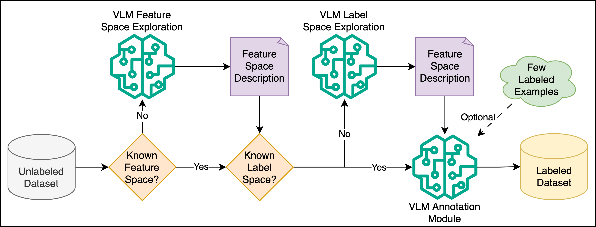

# MSD Benchmark: Vision-Language Model (VLM) Component

The MSD benchmark integrates Vision-Language Models (VLMs) to reduce reliance on dataset-specific classifiers and enable general-purpose reasoning. VLMs are used at two key stages:

1. **Automatic Dataset Annotation**: Automatically discovers and labels factors of variation.
2. **Judging**: Evaluates visual outputs by reasoning about factor values using prompt-based classification.

---

## VLM Backbone Interface

All VLMs in MSD implement the `VLMBackbone` abstract interface, which defines methods for:

- Generating system and user prompts
- Attaching images (base64) to prompts
- Sending prompts to the model API and parsing structured outputs
- Generating few-shot examples from labeled data

This abstraction enables support for OpenAI GPT-4, Claude, Gemini, or any other API-accessible VLM.

### OpenAI GPT Implementation
We provide `OpenAIGPTBackbone`, a concrete implementation that communicates with the GPT-4 API. It supports:

- JSON-structured output parsing
- Zero-shot and few-shot examples
- Image input via base64

Other VLMs can be supported by implementing the same `VLMBackbone` methods.

---

## Automatic Annotation Pipeline



You can annotate an existing `.h5` dataset using the `auto_annotate.py` script. This script explores the factor structure and labels a subset of sequences using a Vision-Language Model (VLM).

### Usage Example
Run the following command from the terminal:

```bash
python auto_annotate.py   --ds_path /path/to/dataset.h5   --subset train   --n_exploration 500   --n_annotation 500   --out_dir /path/to/output   --ds_name my_dataset_name
```

- `--ds_path`: Path to an existing `.h5` file (must follow MSD format)
- `--subset`: Which split to use (`train`, `val`, or `test`)
- `--n_exploration`: Number of sequences used for factor discovery
- `--n_annotation`: Number of sequences to annotate
- `--out_dir`: Where to save the annotated dataset and metadata
- `--ds_name`: A name prefix used for all saved files

This process produces an HDF5 dataset with labeled samples and a `*_classes.json` file describing the discovered factor space.

### DatasetExplorer

The `AutoAnnotator` and `DatasetExplorer` classes enable zero- or few-shot labeling of synthetic and real-world video datasets.

### DatasetExplorer
- Discovers varying visual features by comparing video pairs
- Groups similar features into canonical factor names
- Classifies factors as static or dynamic
- Estimates the label space for each factor

### AutoAnnotator
- Runs the full dataset exploration pipeline
- Saves the discovered label space and annotations as an HDF5 file with metadata
- Uses the `VLMClassifierJudge` to assign factor labels to each sequence

---

## VLM as a Judge

Once label spaces are defined, VLMs can be used as general-purpose **judges** during evaluation.

### VLMClassifierJudge
- Accepts a pre-defined label space (closed set)
- Applies zero-shot or few-shot classification prompts
- Returns structured factor predictions (e.g., pose=up, shirt color=blue)

### VLMContrastiveJudge
- Compares pairs of videos to extract meaningful differences
- Useful when the label space is not predefined or evolving

These judges support:
- Structured, interpretable predictions
- Prompt tuning for different modalities
- Integration into MSD’s evaluation pipeline via `EvaluationManager`

---

## Summary

The VLM module in MSD provides a unified framework for:
- Automatically discovering and annotating datasets
- Replacing dataset-specific classifiers with general-purpose VLM-based reasoning
- Supporting both structured label inference and contrastive reasoning

This makes MSD scalable to new modalities and datasets with minimal manual labeling.